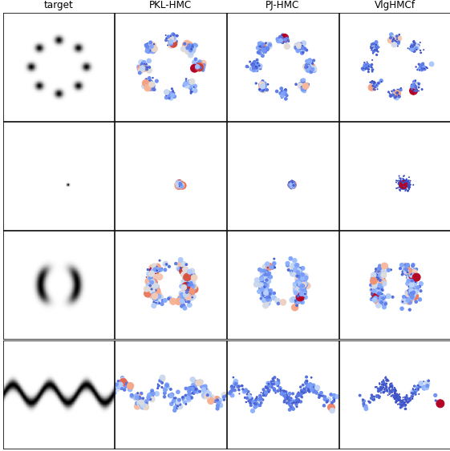
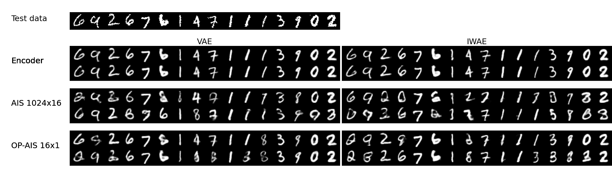

Optimization of Annealed Importance Sampling Hyperparameters
----------------------------
We propose a method to optimize the annealing density path in Annealed Importance Sampling (AIS) algorithm. AIS is a sampling algorithm that is designed to generate weighted samples from an unnormalized target density with multimodal distribution. The performance of this method is sensitive to the choice of annealing density path and deteriorates in high dimensions requiring a large number of iterations to achieve good results. We parameterize the density path with neural networks in OP-AIS (PKL with inverse KL-divergence optimization and PJ with BiDirectional Monte Carlo Gap minimization) for low computation budget setup. The training cost is amortized in latent variable posterior normalization.

**1D benchmark weighted samples with M=32 and HMC transition kernels**

**MNIST data reconstrucion from VAE and IWAE posterior samples with M=16 and HMC transition kernels**

**Run Experiments**
Use examples in codetest.ipynb

